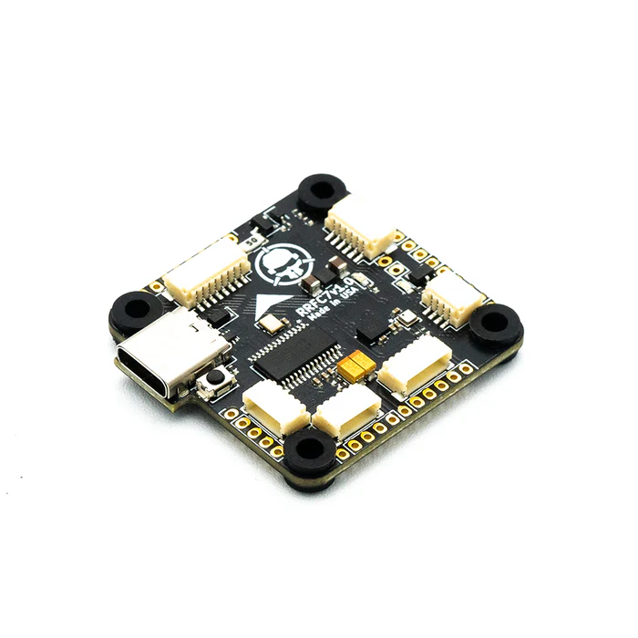
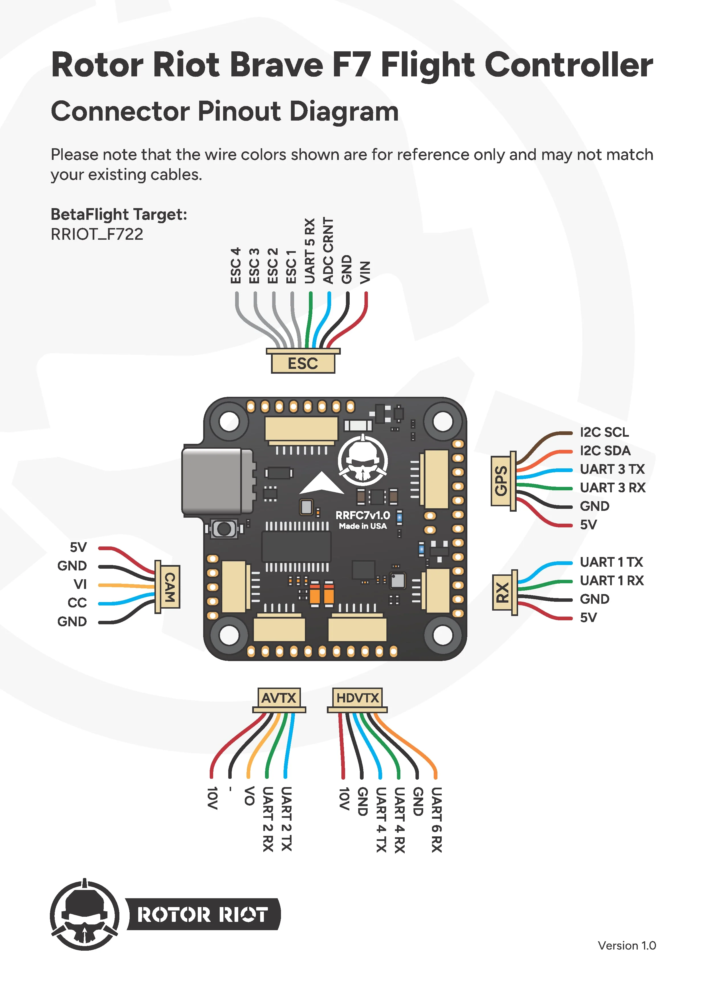
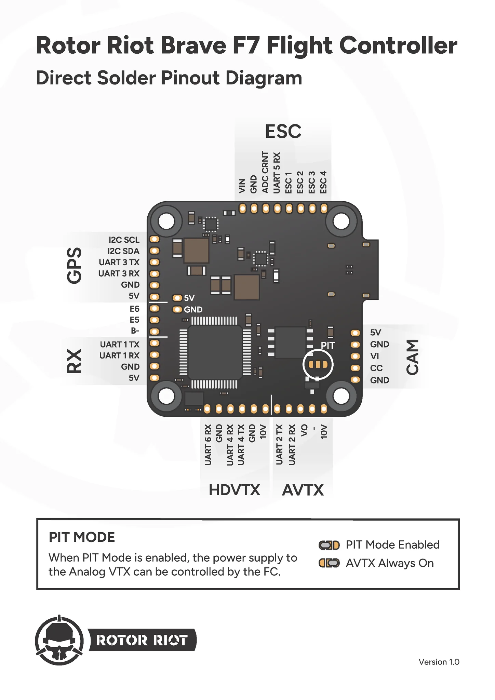
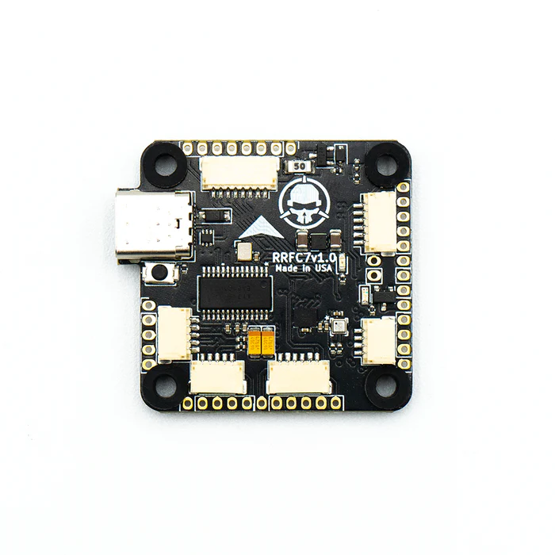
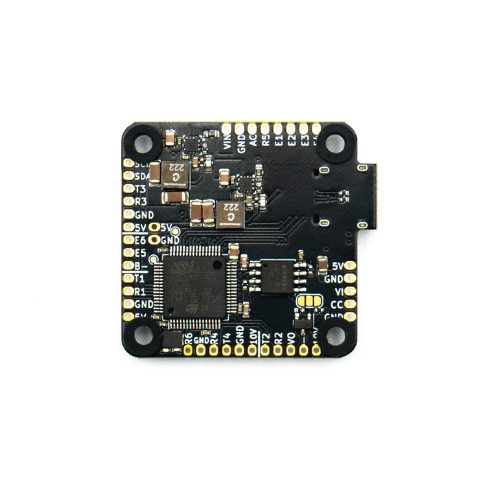

---
sidebar_custom_props:
  specs:
    target: RRIOT_F722
    mcu: STM32G473CEU6
    imu:
    osd:
    barometer:
    flash: W25Q128JVPQ (16MB)
    dimensions: 35x35mm
    mounting: 25.5x25.5mm
    weight: 10.4g
---

import Tabs from '@theme/Tabs'
import TabItem from '@theme/TabItem'
import SpecGrid from '@site/src/components/SpecGrid'

# Rotor Riot Brave F7

<Tabs>

<TabItem value="specifications" label="Specifications" default>

<SpecGrid>

</SpecGrid>

## Other Features

- SD Card Slot: No
- Onboard Receiver: No
- Hardware Inverter: No
- Bluetooth: No
- WiFi: No
- Onboard RGB LED: No

## Input/Output

- USB Connector: USB Type-C
- ESC Outputs: 6x
- UARTs: 6x
- I2C: Yes
- SWD: No
- SPI: No
- 3.3V Output: Yes
- 4.5V (VBUS) Output: No
- 5V Output: 2A
- 10V Output: 2A
- Current Sensor: Yes
- Analog RSSI Input: No
- LED Strip Output: No
- Buzzer Output: Yes

## Pads

### UARTs

| Name   | Label | Notes         |
| ------ | ----- | ------------- |
| UART 1 | T1/R1 | Receiver      |
| UART 2 | R2/T2 | Analog VTX    |
| UART 3 | R3/T3 | GPS           |
| UART 4 | T4/R4 | HD VTX        |
| UART 5 | R5    | ESC Telemetry |
| UART 6 | R6    | HD VTX        |

### Power

| Name            | Label | Count | Notes |
| --------------- | ----- | ----- | ----- |
| 5V              | 5V    | 3x    |       |
| 10V             | 10V   | 1x    |       |
| Battery Voltage | VIN   | 1x    |       |

### Analog Video

| Name           | Label | Notes |
| -------------- | ----- | ----- |
| Video In       | VI    |       |
| Camera Control | CC    |       |
| Video Out      | VO    |       |

### Buzzer

| Name     | Label | Notes |
| -------- | ----- | ----- |
| Buzzer - | B-    |       |

### I2C

| Name  | Label | Notes |
| ----- | ----- | ----- |
| Clock | SCL   |       |
| Data  | SDA   |       |

## Connectors

### ESC 1-4

| Pin | Name            | Label |
| --- | --------------- | ----- |
| 1   | Battery Voltage | VIN   |
| 2   | Ground          | GND   |
| 3   | Current         | AC    |
| 4   | Telemetry       | R5    |
| 5   | Signal 1        | E1    |
| 6   | Signal 2        | E2    |
| 7   | Signal 3        | E3    |
| 8   | Signal 4        | E4    |

### Camera

| Pin | Name           | Label |
| --- | -------------- | ----- |
| 1   | 5V             | 5V    |
| 2   | Ground         | GND   |
| 3   | Video In       | VI    |
| 4   | Camera Control | CC    |
| 5   | Ground         | GND   |

### Analog VTX

| Pin | Name      | Label |
| --- | --------- | ----- |
| 1   | 10V       | 10V   |
| 2   | Ground    | -     |
| 3   | Video Out | V0    |
| 4   | UART2 RX  | R2    |
| 5   | UART2 TX  | T2    |

### Digital VTX

| Pin | Name     | Label |
| --- | -------- | ----- |
| 1   | 10V      | 10V   |
| 2   | Ground   | GND   |
| 3   | UART1 TX | TX1   |
| 4   | UART1 RX | RX1   |
| 5   | Ground   | GND   |
| 6   | SBUS     | TX2   |

</TabItem>

<TabItem value="wiring" label="Wiring Diagrams">

</TabItem>

<TabItem value="photos" label="Photos">

</TabItem>
	
</Tabs>
